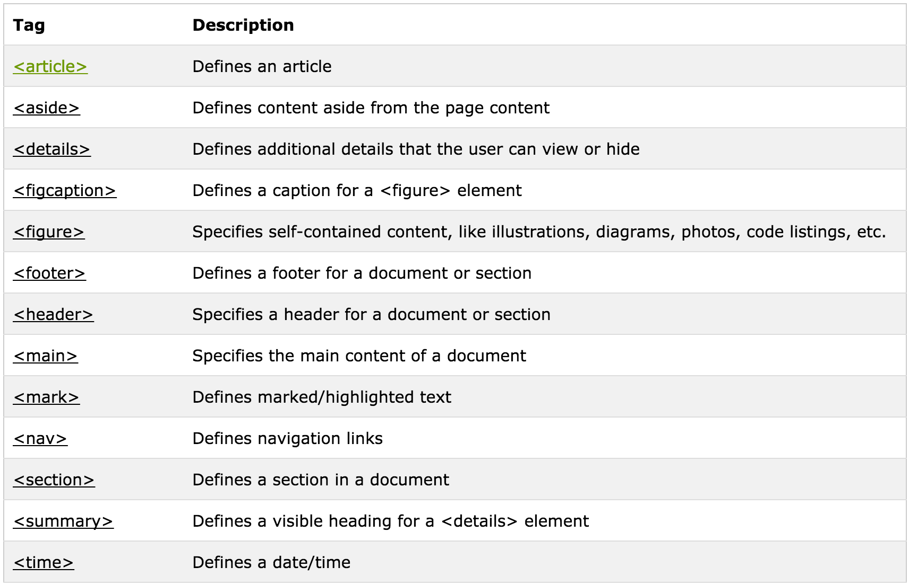

# Semantic HTML5

Non-semantic elements:
- div
- span

Semantic Elements:
- header
- nav
- section
- article
- main
- aside
- footer



## Div-itis!
```
"Is that div part of the outline of the page, defining a section or a subsection?" Or "is it only a presentational div, only used for styling?")
```

Overusing div tags for defining semantic sections makes automatic outlining impossible.

For assistive technology, automatic outlining is important. Information gets presented to the users according to the structure of the document. A document can have special sections containing information that is not part of, though it is related to, the main flow, like an advertisement block or an explanation box. HTML5 introduces the aside element allowing such sections to not be part of the main outline. Sections containing information related not to the document but to the whole site, like logos, menus, table of contents, or copyright information and legal notices. For that purpose, HTML5 introduces three new elements: nav for collections of links, such as a table of contents, footer and header for site-related information. Note that header and footer are not sectioning content like section, rather, they exist to semantically mark up parts of a section.
